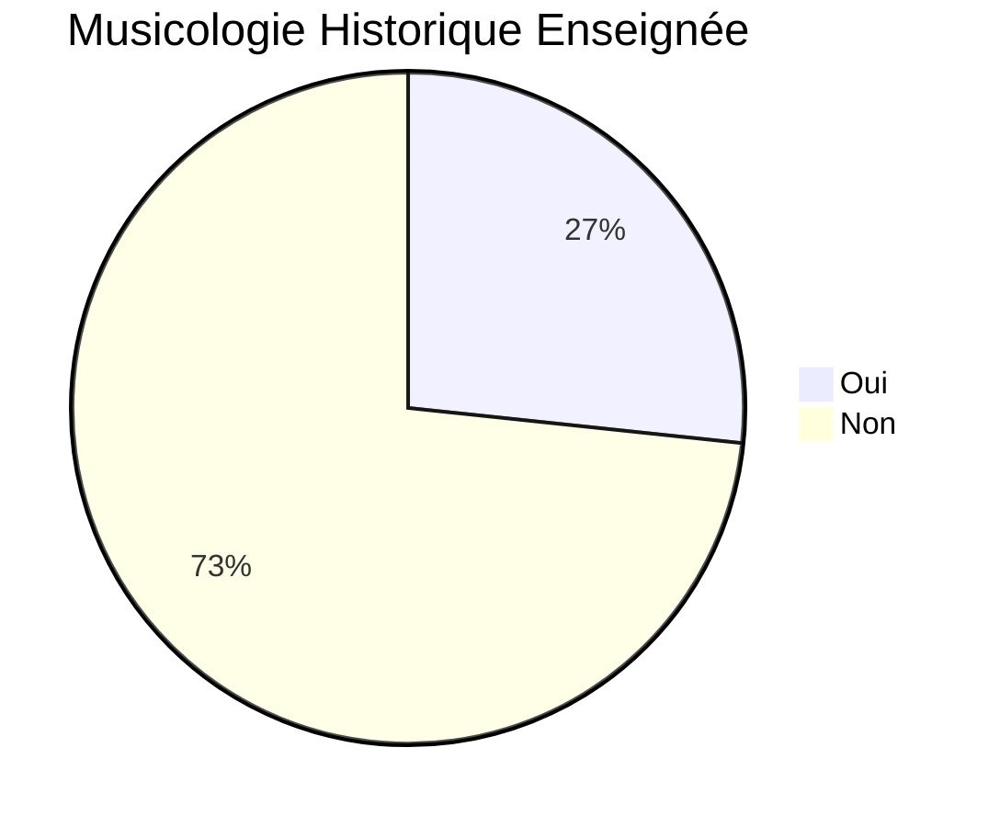
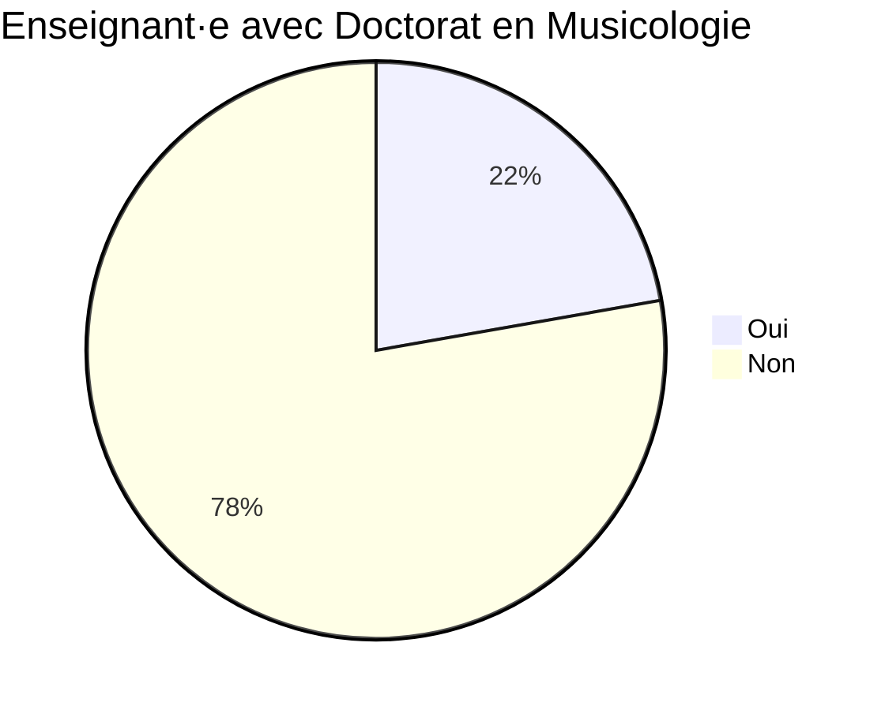
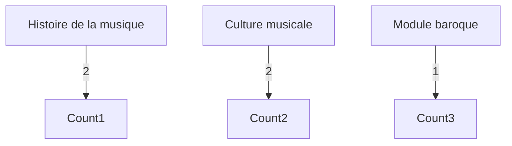

# Analyse des réponses - Musicologie dans les Conservatoires

## 1. Enseigne-t-on la musicologie historique ?

## 2. L'enseignant·e détient-il/elle un doctorat en musicologie ?

## 3. Appellation(s) de l'enseignement

